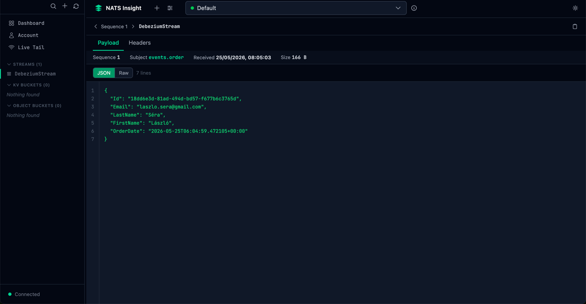
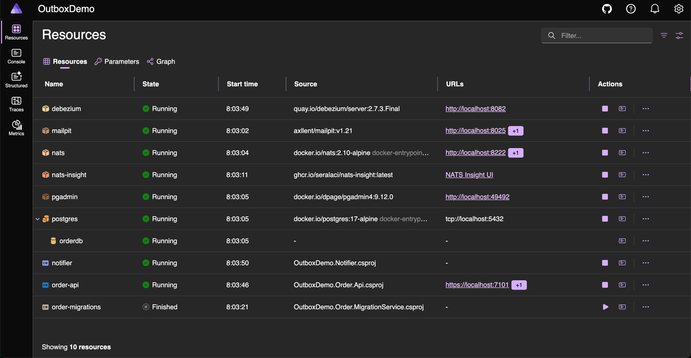
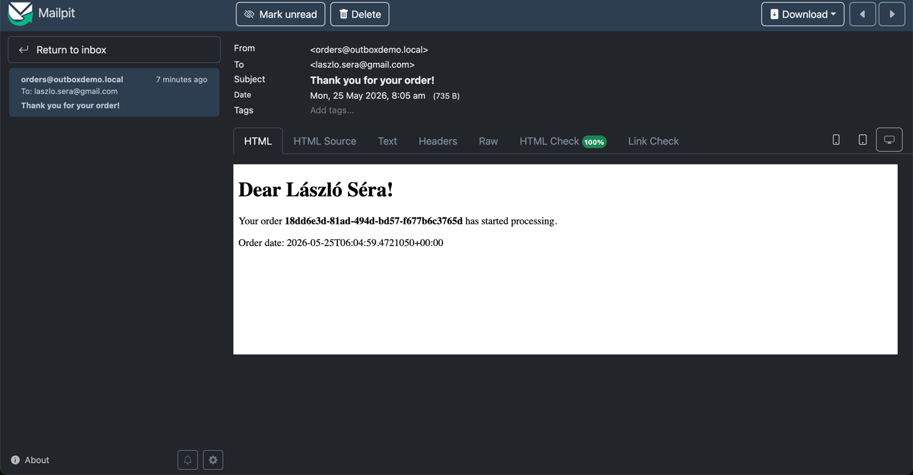

# Outbox Pattern .NET 10 + Aspire + PostgreSQL + Debezium + NATS

A reference implementation of the transactional outbox pattern on
**.NET 10** + **.NET Aspire**, with **PostgreSQL 17** logical replication,
**Debezium Server** for CDC, and **NATS JetStream** as the message bus.



## Architecture

```
+------------------+        +-------------------+        +---------------------+
|                  |        |                   |        |                     |
|   Order.Api      |--TX--->|  PostgreSQL 17    |<--WAL--|  Debezium Server    |
|  (Minimal API)   |        |  orders + outbox  |        |  (PG -> NATS sink)  |
|                  |        |                   |        |                     |
+------------------+        +-------------------+        +---------+-----------+
                                                                   |
                                                                   v
                                                       +-----------+-----------+
                                                       |                       |
                                                       |  NATS JetStream       |
                                                       |  stream: outbox-events|
                                                       |  subject: order.events|
                                                       |                       |
                                                       +-----------+-----------+
                                                                   |
                                                                   v
                                                        +----------+----------+        +----------+
                                                        |                     |        |          |
                                                        |  Notifier service   |--SMTP->| Mailpit  |
                                                        |  (JetStream pull)   |        |          |
                                                        +---------------------+        +----------+
```

The full infrastructure (PostgreSQL, NATS JetStream, Debezium Server, Mailpit,
pgAdmin) and the .NET services are started with a single command: the **Aspire AppHost**.

## Components

| Project | Description |
|---------|-------------|
| `OutboxDemo.AppHost` | Aspire orchestrator – containers (PostgreSQL + pgAdmin, NATS + NATS Insight, Mailpit, Debezium Server) and service wiring |
| `OutboxDemo.ServiceDefaults` | Shared OpenTelemetry, health checks, service discovery |
| `OutboxDemo.Shared` | Common contracts (event payload, NATS subject names) |
| `OutboxDemo.Order.Api` | .NET 10 minimal API: order CRUD, outbox in the same transaction |
| `OutboxDemo.Order.MigrationService` | Worker that creates the EF Core schema, the PG publication, and the NATS stream |
| `OutboxDemo.Notifier` | NATS JetStream durable consumer + Mailpit SMTP sender |

## Prerequisites

- [.NET 10 SDK](https://dotnet.microsoft.com/download/dotnet/10.0) (10.0.101 or newer due to the `latestFeature` rollForward)
- [Docker Desktop](https://www.docker.com/products/docker-desktop/) or Podman (Aspire container runtime)
- HTTPS dev cert installed: `dotnet dev-certs https --trust`

## Running

```bash
git clone <this-repo>
cd dotnet-microservices-outbox-pattern-debezium-nats
dotnet build outbox-pattern.slnx
dotnet run --project src/Aspire/OutboxDemo.AppHost
```

The Aspire dashboard URL appears on the console (`https://localhost:17239` by default).
From there every resource is reachable: logs, traces, NATS, PostgreSQL, Mailpit, Debezium, and the API.

## Test

1. On the Aspire dashboard, wait until every resource reaches the **Running** state
   (`order-migrations` should reach **Exited** after it runs).



2. Open the **Scalar API reference** for `Order.Api` at
   `http://localhost:5101/scalar/v1` (or click the `order-api` resource on the
   Aspire dashboard and follow the Scalar link). Pick the `POST /orders`
   endpoint, fill in the request body, and hit **Send**.


3. Within a few seconds the "Thank you for your order!" email appears in Mailpit (`http://localhost:8025`).



## Configuration endpoints

| Component | Address | Purpose |
|-----------|---------|---------|
| Aspire dashboard | `https://localhost:17239` | OTLP traces, logs, metrics, resource graph |
| Order.Api OpenAPI | `http://localhost:5101/openapi/v1.json` | OpenAPI document |
| Order.Api Scalar UI | `http://localhost:5101/scalar/v1` | Interactive API reference; send requests from the browser |
| Mailpit UI | `http://localhost:8025` | Email testing |
| NATS monitor | `http://localhost:8222` | JSON endpoints: `/varz`, `/jsz` (raw) |
| NATS Insight UI | URL shown on the dashboard | Browser-based JetStream stream/consumer/message explorer |
| pgAdmin | URL shown on the dashboard | PostgreSQL UI |
| Debezium Server | `http://localhost:8082` | Debezium Quarkus health/metrics |

## Data flow details

1. **Order creation**: `Order.Api` writes the `orders` and `outbox_messages` tables
   in a single EF Core transaction. The `payload` column is of type `jsonb` and
   stores the serialized `OrderCreatedEvent`.

2. **Logical replication**: the PostgreSQL `pgoutput` plugin publishes changes
   to the `outbox_messages` table (registered in `dbz_outbox_publication`)
   through a replication slot (`dbz_outbox_slot`) via the WAL.

3. **Debezium Server**: the `quay.io/debezium/server:2.7.3.Final` container reads
   the PostgreSQL WAL, applies the **Outbox Event Router** transform
   (`io.debezium.transforms.outbox.EventRouter`), and forwards messages to the
   NATS JetStream sink:
   - subject = `events.order` (static, because the `${routedByValue}` placeholder
     is not substituted correctly when passing through Quarkus/SmallRye Config)
   - key = `aggregate_id`
   - value = the `payload` column in expanded JSON form

4. **NATS JetStream**: the `DebeziumStream` stream (created by Debezium)
   captures messages matching the `events.>` subject pattern in memory.
   The `events.>` prefix avoids overlap with the NATS `$JS.>` system subject hierarchy.

5. **Notifier**: the `notifier-order-events` **durable consumer** reads the stream
   in explicit ACK mode, deserializes the `OrderCreatedEvent`, and sends an email
   to Mailpit via MailKit. On NAK it retries up to 5 times.
   During startup it waits for the stream to come up using exponential retry.

## Troubleshooting

| Symptom | Cause | Resolution |
|---------|-------|------------|
| `order-migrations` exit code != 0 | PG not ready yet | Re-run `dotnet run --project AppHost` |
| Debezium fails to start | `wal_level != logical` | The AppHost starts PG with `-c wal_level=logical`, so this is fine by default |
| No messages arrive at the Notifier | The `DebeziumStream` does not exist yet | The Notifier waits with exponential retry until Debezium creates it |
| Mailpit does not receive mail | SMTP port mapping | The `mailpit:smtp` endpoint is exposed to the Notifier |

### Known compatibility limits

- **NATS Server version**: we use the `nats:2.10-alpine` image. The "Strict JetStream
  API" mode of `nats:2.12+` may cause compatibility issues with the NATS Java client
  used by Debezium Server (`io.nats.client.impl.NatsJetStream`).
- **Debezium heartbeat**: `debezium.source.heartbeat.interval.ms=0` (disabled), because
  the `__debezium-heartbeat.<prefix>` subject does not match the `events.>` stream filter,
  and with the heartbeat enabled Debezium gets a `503 No Responders` error when publishing.
- **`${routedByValue}` placeholder**: passing through Quarkus/SmallRye Config breaks
  substitution of the Debezium transform, so `route.topic.replacement` uses a static
  topic name (`events.order`). When introducing additional aggregate types, the
  [`ContentBasedRouter`](https://debezium.io/documentation/reference/stable/transformations/content-based-routing.html)
  SMT or aggregate-level topic mapping is the recommended solution.
- **Event-type header**: the Debezium NATS JetStream sink does not currently propagate
  per-message headers into NATS message headers, so the Notifier identifies the event
  type from the subject name (`events.order` → `OrderCreated`).

## Structural decisions

- **One DbContext, two DbSets**: `OrderDbContext` contains both the `Orders`
  and `OutboxMessages` tables so that a single `SaveChangesAsync()` guarantees
  atomicity in one transaction (classic outbox-pattern requirement).
- **EnsureCreated vs migrations**: the demo uses `EnsureCreated` because the
  schema is trivial. In production this should be replaced with EF migrations.
- **Outbox deletion ("no-additional-space")**: the `POST /orders/no-additional-space`
  endpoint `DELETE`s the outbox row in the same transaction as the INSERT. Debezium
  still captures the INSERT from the WAL, while the row itself does not occupy
  any table space afterwards.
- **`jsonb` payload**: the `payload` column is `jsonb` in PostgreSQL, so the Debezium
  `expand.json.payload=true` transform can forward it as native JSON.

## License

MIT.
